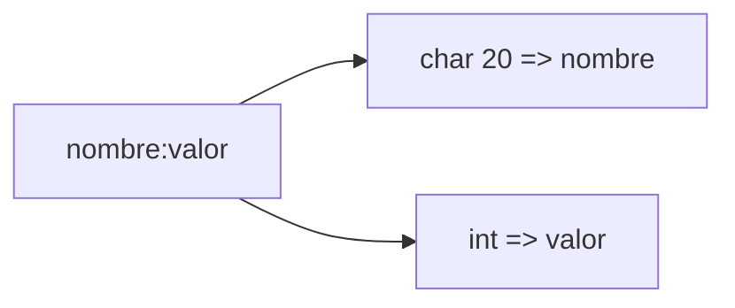
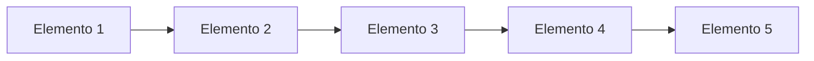

# Listas .h

*Libreria de listas implementadas en C.*

## Estructura de el nodo de la lista 
```c
typedef struct node
{
	char name[20];
	int value;
	struct node *next;
} Node;
```

Dividiendose este en 

 - **Nombre:** Elemento de tipo char[20] para guardar cadenas de texto
 - **Valor:** Elemento de tipo int, para guardar numeros 
 - **Next:** Direccion del proximo nodo 


## Funciones que puede realizar 

### 1.  Anadir un elemento al inicio
*Agrega un elemento justo al inicio de la lista*

Antes 


Despues 

 
### 2. Anadir un elemento al final

*Agrega un elemento justo al final de la lista*

Antes 


Despues 


### 3. Invertir la Lista
*Invierte la direccion en la que apuntan los elementos d ela lista *

Antes 


Despues 


### 4. Copiar la lista a una nueva
*Permite crear una nueva lista apartir de otra*

Antes 

 - Lista 1:


Despues 
 - Lista 1:


 - Lista 2:


### 5. Imprimir la lista
*Permite leer los lementos de la lista en consola*

Teniendo 

Salida en consola
```bash
Elemento 1:Valor1 --> Elemento 2:Valor2 --> Elemento 3:Valor3
```
### 6. Concatenar las dos listas
*Permite unir 2 listas* 
Antes 


 - Lista 1:


 - Lista 2:


Despues
 - Lista resultante:


---
### Otras funciones de las que dispone


```c   
in_counter(Node *listp): Cuenta el numero de 
nodos de una lista 
``` 
```c   
free_all(Node *listp): libera la memoria de una lista 
``` 
```c   
del_item(Node *listp, char *name): elimina la primera 
ocurrencia de name y retorna la nueva lista
``` 
```c   
is_empty(Node *listp): retorna 1 si esta vacia, 
0 en caso contrario
``` 

 
